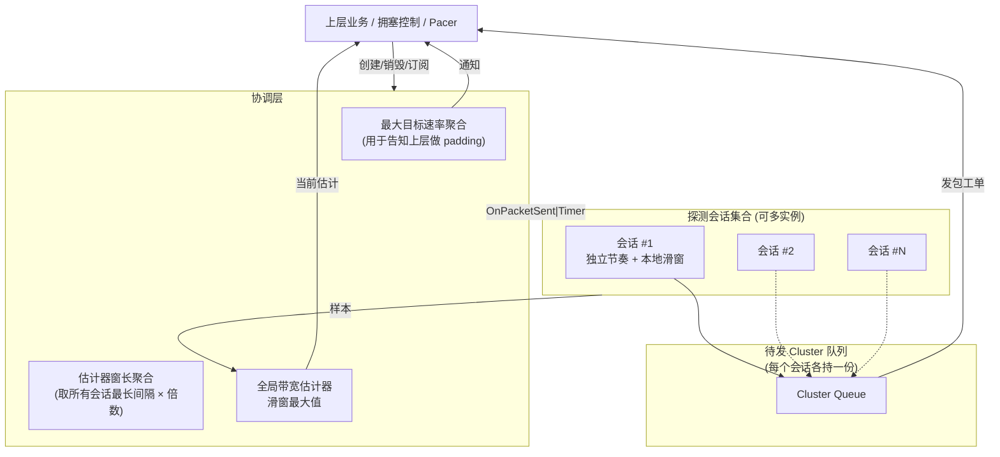
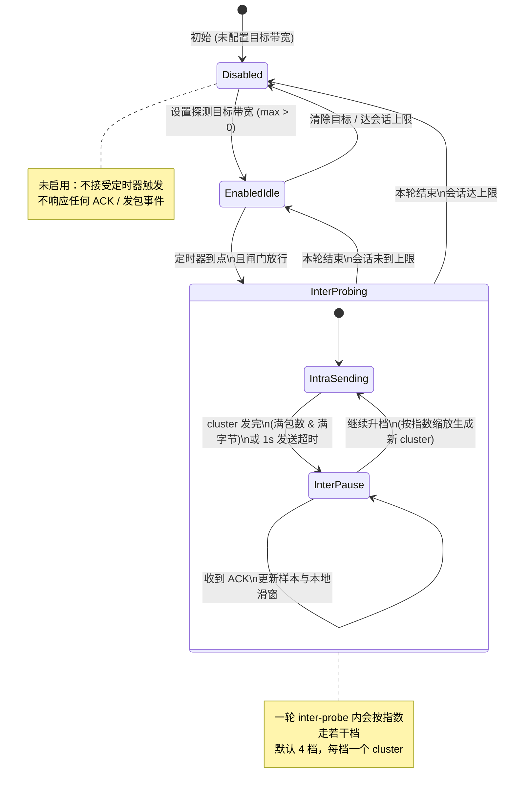
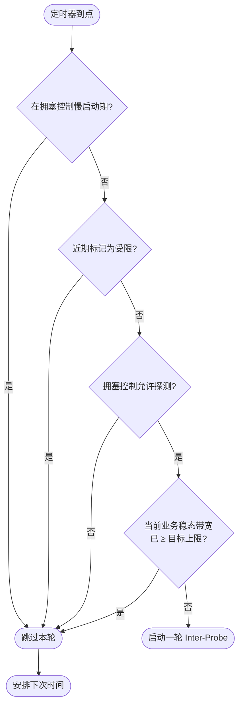
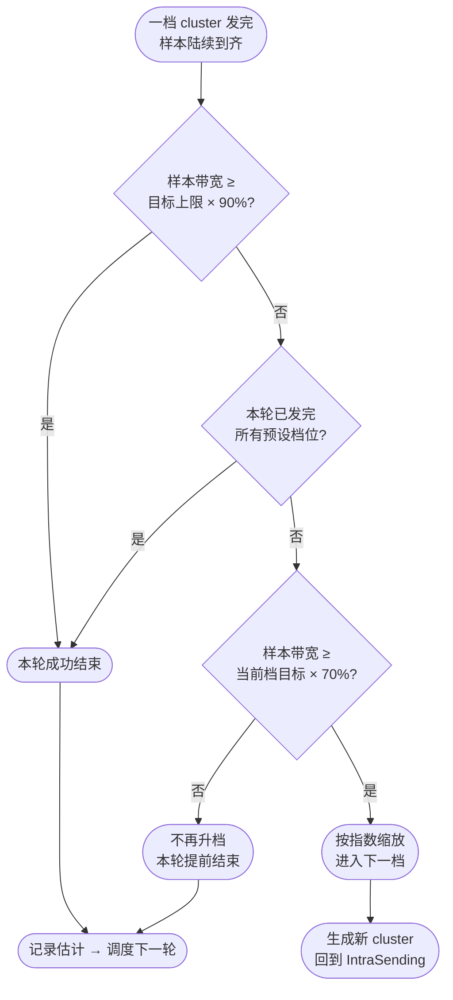
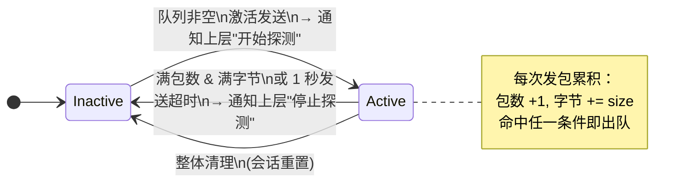
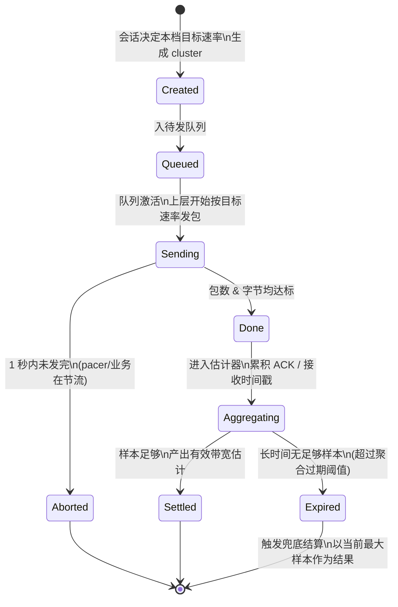
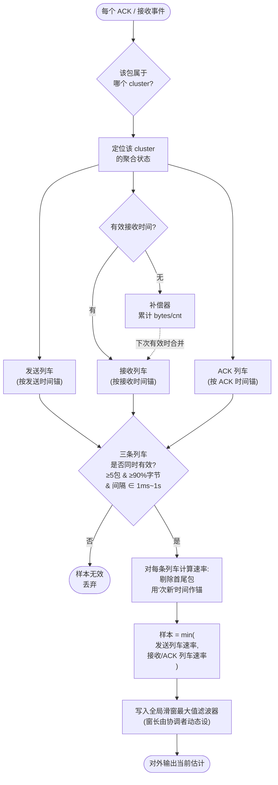
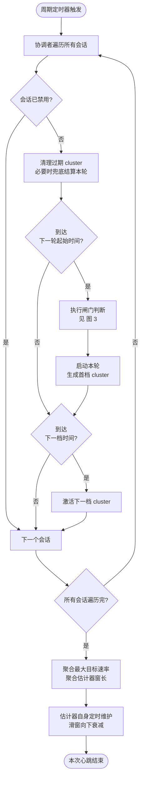
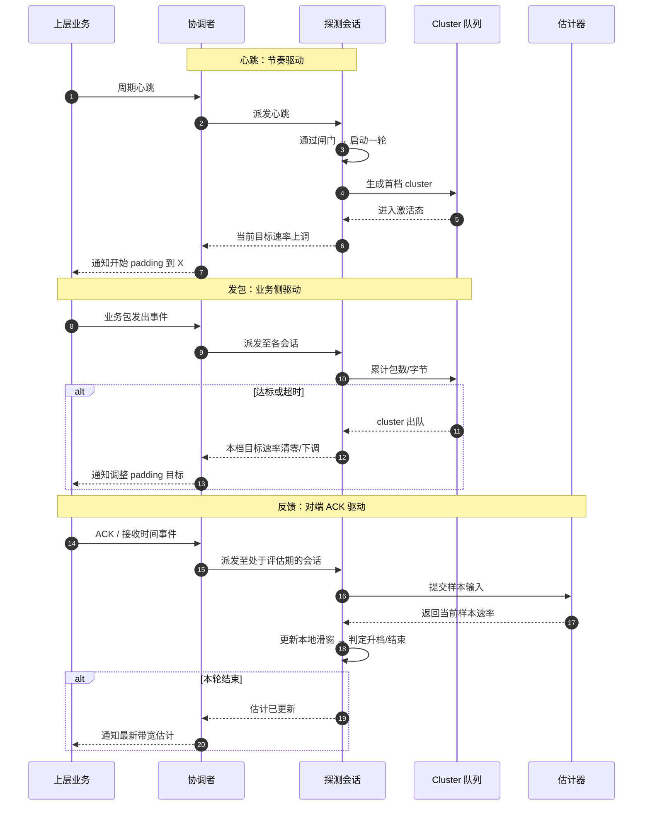

> 带宽探测通过主动制造可控的数据突发，去探测真实的链路带宽上限，来弥补被动拥塞控制**业务发多快、就只能看见多快**的盲区—，这是实时音视频以及移动网络场景里，尽量把码率拉满、又不至于把链路打爆的前提。

## 为什么需要主动探测

拥塞控制会根据 ACK 和丢包反馈调节发送速率，但它天然偏向跟着业务走,业务层发得慢，观测到的带宽就低；业务发得快，才更容易看到上限。

然而业务方普遍的偏保守（例如在弱网下主动降低码率甚至暂停发送），系统可能长期低估可用带宽。主动探测的价值在于：**在合适时机注入一小段可控的突发数据**，用样本反推链路能力，再把结果反馈给上层做码率决策，最终获得真实的码率上限。

## 1. 整体架构图

协调层 ProbeManager 聚合多个探测会话，统一维护全局带宽估计，并把最大目标速率、探测窗口时长等参数回传给上层；每个会话独立维护自己的探测节奏、本地滑窗和待发的 Cluster 队列。

---

## 2. 单个探测会话状态机（核心状态机）

- **Disabled**：未启用，不响应定时器与 ACK。
- **EnabledIdle**：已设目标，等待下一轮触发。
- **InterProbing**：一轮内默认约 4 档，每档对应一个 cluster；ACK 在暂停态更新样本与本地滑窗。

---

## 3. 启动会话前的闸门判断

不是每个定时器到点都会探测。需同时满足：非慢启动、非近期受限、拥塞控制允许、且当前稳态带宽尚未达到目标上限。

---

## 4. 单档 Intra-Probe 推进策略

一档 cluster 发完且样本到齐后：达到目标上限 90% 则成功结束；已走完预设档位则结束；当前档不足 70% 则提前结束；否则按指数缩放进入下一档。

---

## 5. Cluster 队列的子状态机

队列在「非激活 / 激活」间切换：有 cluster 待发则激活并通知上层开始探测；满包数且满字节，或 1 秒发送超时，则回到非激活并通知停止。

---

## 6. Cluster 完整生命周期

单个 cluster 从创建、入队、发送，到完成或中止，再进入估计器的聚合与结算；样本不足过久则过期，并以当前最大样本兜底。

---

## 7. 带宽估计

每个 ACK/接收事件按 cluster 归入聚合状态，在发送、接收、ACK 三条「列车」上分别建样本；三条同时有效时取各列车速率的最小值，再写入全局滑窗最大值滤波器。

---

## 8. 定时器主循环（驱动一切的心跳）

周期心跳驱动一切：遍历会话、清理过期 cluster、按节奏启动新一轮或激活下一档，最后聚合全局参数并维护估计器滑窗衰减。

---

## 9. 三类回调的总览（时序角度）

从时序上讲，探测由三类事件串联：**心跳**定节奏、**发包**执行 cluster、**ACK** 回填样本并驱动升档或结束。
