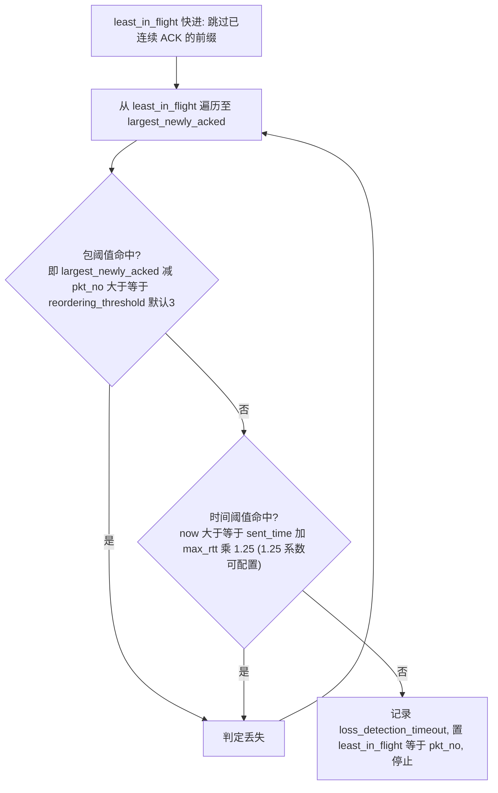
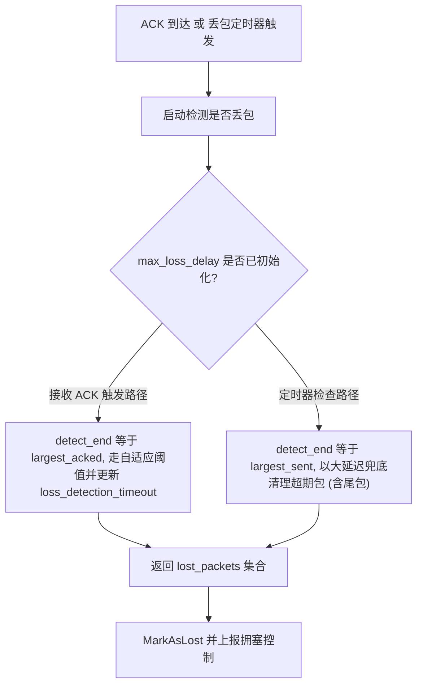
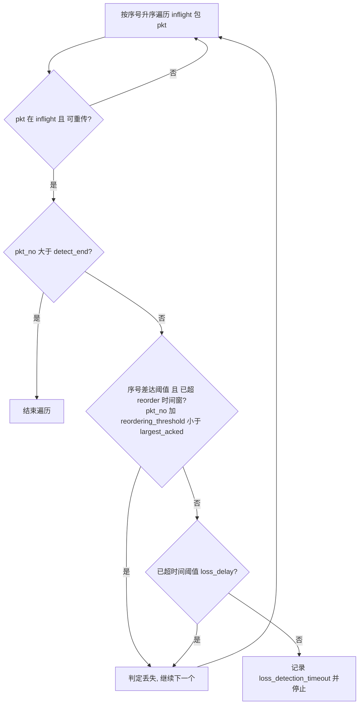
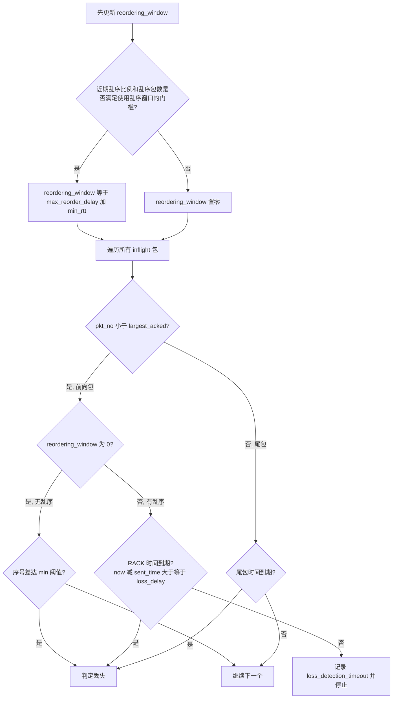

> 针对 QUIC 中丢包检测算法做相应的优化，使其在不同的场景下更加的灵活，做到灵活调整，在 RTC 低延迟传输需求下更加激进，通过更快、更早的判定丢包以进行重传，才能降低整体的端到端延迟；在高延迟、高乱序场景下偏向保守，降低误判概率。

> QUIC 的丢包检测实现中存在乱序窗口不能灵活调整下限的问题。
> QUIC 源码：`quiche/gquiche/quic/core/congestion_control/general_loss_algorithm.cc` 成员变量 reordering_threshold_ 只有上升取大的机制，而没有下降重制的机制，在灵活多变的用户网络中存在明显的弊端，当用户网络乱序特性消失后，QUIC 中永远保留了最大的乱序窗口，导致丢包检测一直延后这样的一个窗口，不利于低延迟传输。

---

## 1. 为什么需要「自适应」的丢包检测

发送端判定一个包丢了，本质上只有两类信号：

- **序号信号（packet threshold）**：后面的包都 ACK 了，中间的还没来，且`空洞`足够大 —— 大概率丢了，对应 TCP 的 3 次重复 ACK 判定丢包的策略。
- **时间信号（time threshold）**：这个包发出去已经超过`合理的等待时间`还没 ACK —— 大概率丢了，对应 RACK / Early Retransmit。

难点在于**乱序（reordering）**：网络会把包的顺序打乱，一个迟到的包不等于丢失的包。判早了 ==>> 伪重传，浪费带宽、误伤拥塞控制；判晚了==>>恢复延迟高，实时业务卡、慢。

所以最佳的实现需要**自适应**：根据实测的乱序程度，动态调整"空洞多大算丢"和"等多久算丢"。

---

## 2. 首先查看 QUIC 实现机制

实现类：`GeneralLossAlgorithm`，其中：

`least_in_flight` 为最小的 inflight 的包序号。

`reordering_threshold` 默认为 3，实际运行中通过 `SpuriousLossDetected` 进行检测调整。




要点：

- **单趟同时判 packet 与 time**：任一命中即丢，`reordering_threshold_` 默认 **3**,运行中根据统计实时调整，但仅向上取大(Bug)，时间阈值固定 `max_rtt × 1.25`（`reordering_shift_ 默认 2，可以配置`）。
- **自适应**：`use_adaptive_reordering_threshold_`（默认开）伪丢包时抬包阈值；`use_adaptive_time_threshold_`（默认关）伪丢包时降 shift 放宽时间窗。
- **runt 包保护** `use_packet_threshold_for_runt_packets_` 默认开启，个人观点认为不需要这种策略，保持默认值即可。
- 尾丢包同样交给 PTO（与 RUT 序号版一致）。

---

## 3. 算法调优

实现两种丢包检测算法，分别基于 packet number 和 Time，分别用于低延迟、低乱序窗口下的低延迟传输场景，和高延迟、高乱序窗口的场景，丢包判定趋于保守，以用于不同的网络场景。

两中丢包检测算法的实现中，判断丢包基于时间兜底的公式均如下：

```
early_retransmit_delay = clamp(loss_delay_multiplier × max_rtt + 0.5 × mean_deviation, [5ms, 3s])
其中 loss_delay_multiplier 可配置，配置范围 [1, 2]。
```



---

### 3.1 AdaptiveSequence：序号优先（默认）

参考 **TCP 3-dupack + Early Retransmit** 思路：以**序号跳变**为主要判断依据，时间窗做门控，最后有一条纯时间判断兜底。

- **条件 A（序号）**：`pkt_no + reordering_threshold_ < largest_acked`，即包序号在乱序窗口之外。
- **条件 B（时间）**：`IsExpired(now, loss_delay)`，对遍历到的所有包生效（尾包在周期性检查时靠大 hint（默认 3秒） 兜底）。
- **闭环自适应**（`SpuriousLossDetected`）：以一定包数为窗（默认300）统计伪重传率，如果`> 1%` 则阈值 `+1`，如果`< 0.1%` 则 `-1`，限制在配置范围内，建议[1,100]；如果遇到 `round_trip_delay > 3 × max_rtt` 的伪丢包判为"非乱序"而剔除。
- **快速重置**：当检测到网络中不再存在乱序后，将乱序阈值设置为 min，避免无乱序后，依然保持乱序窗口导致丢包检测的延迟。
- **尾丢包**：ACK 路径不快速覆盖，注释明确交给 TLP/PTO，靠周期性检测进行兜底。



---

### 3.2. AdaptiveTime：时间优先（RACK 风格）

思路贴近 **RACK-TLP（RFC 8985）**：以**时间窗**为主要判断依据，序号只在"无乱序"时做 fallback，并原生覆盖尾丢包。

- **动态时间窗** 首先确定乱序时间窗口：如果有检测到乱序，则乱序窗口为 `max_reorder_delay` + `min_rtt`，否则为 0。
- **largest_acked 之前的包**：
  - 窗为 0（无乱序）→ fallback 到序号跳变 `pkt_no + min_reordering_threshold_ < largest_acked`；
  - 否则 RACK 判丢依据 `IsExpired(now, max(reordering_window_, early_retransmit_delay))`，其中 early_retransmit_delay = smoothed_rtt * loss_delay_multipier + mead_deviation / 2, loss_delay_multipier 配置范围 [1, 2]。
- **largest_acked 之后的尾包**：直接用包最大有效时间判断是否丢包，以此覆盖尾丢包检测（与 Sequence 版最大不同）。




---

## 4. 三者横向对比

| 维度 | New AdaptiveSequence | New AdaptiveTime | QUIC General |
| --- | --- | --- | --- |
| 对标 | TCP 3-dupack + Early Retransmit | RACK-TLP (RFC 8985) | QUIC 双阈值 |
| 判断主依据 | 序号阈值（时间窗兜底） | 时间窗 RACK（无乱序时，使用序号判断） | 包序号阈值 与 时间阈值并列 |
| 序号阈值默认 | 动态检测调整 | 固定容忍 1 个包的乱序 | 默认为3，可动态调整向上，但不下降探测 |
| 时间阈值 | `mult×max_rtt + 0.5·mdev`，[5ms, 3s] | 同左，取 `max(reorder_window, 该值)` | `smoothed_rtt × 1.25`，其中 1.25 可配，但不够灵活 |
| 尾丢包 | ❌ 靠 TLP/PTO + 兜底 | ✅ 原生覆盖 | ❌ 靠 PTO |

---

## 8. 总结

该算法优化用两套可切换的丢包检测把`实时低时延`和`抗乱序稳健`拆成了两条路径，比 QUIC 单一 General 算法更贴合 RTC 场景。
