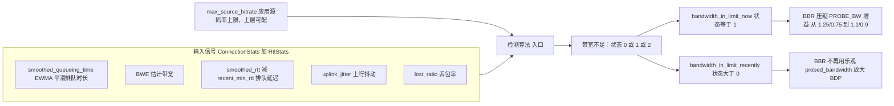
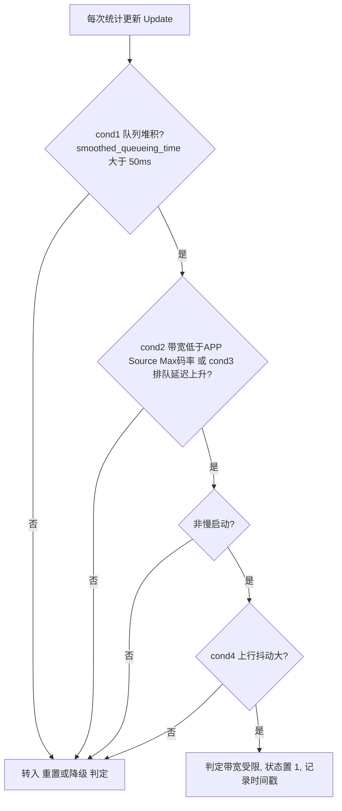
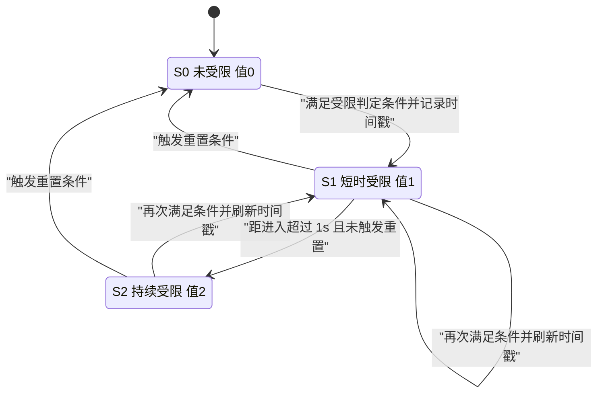

# 带宽受限检测算法

> 本文介绍带宽受限检测算法的实现原理：通过「queueing + rtt + jitter + lost」四类信号综合判定链路是否是真正的带宽受限，又如何把这个判定回喂给 CC，让拥塞控制在瓶颈链路上主动收敛探测、避免把队列越灌越满。

---

## 为什么要单独做「带宽受限检测」

BBR 拥塞控制算法会周期性的通过 `PROBE_BW` 阶段把发送速率抬到 `1.25 × 估计带宽`，试探"是不是还有更多带宽可用"。在带宽充足时这没问题；但当链路**已经是瓶颈**时，这种试探只会把数据堆进网络缓冲区（bufferbloat）中，推高排队延迟、诱发丢包，严重影响实时音视频的传输体验。

但问题在于：**CC 自己很难分清"我还能再快一点"和"链路已经喂不动了"**。该带宽受限检测算法与另外两种情况不同，需要分清楚：

- **应用受限（即 app-limited）**：应用层本身没那么多数据要发，此时的带宽采样数据并非真正的网络容量。
- **瞬时抖动**：RTT/Lost 的偶发毛刺，不代表持续受限。

`带宽受限检测` 的职责就是给出一个可靠的布尔信号：**当前是不是真的带宽受限**。一旦确认受限，BBR 就把探测增益从 `1.25/0.75` 压到温和的 `1.1/0.9`，并停止用乐观的 `探测带宽` 去放大拥塞窗口。

---


## 整体数据流

检测器每次统计更新（协议内部触发）被调用一次，统计/输入一批新的链路指标，输出一个三态的受限程度，再映射成两个布尔量回喂给 BBR：




- `bandwidth_in_limit_now`:（状态 == 1，刚判定受限）
- `bandwidth_in_limit_recently`:（状态 > 0，近期处于受限）

消费端（BBR 算法内）：

- `EnterProbeBandwidthMode` / `UpdateGainCyclePhase`：`bandwidth_in_limit_now` 为`true`时把探测增益压成 `1.1/0.9`；
- `GetTargetCongestionWindow`：`bandwidth_in_limit_recently` 为`true`时不采用 `probed_bandwidth` 去扩大 BDP。

---


## 判定条件：四个信号的组合

进入「受限」状态需要**同时**满足下面的组合条件：

```
cond1 且 (cond2 或 cond3) 且 (非 StartUp mode) 且 cond4
```

四个子条件各自捕获带宽受限的一个侧面：


| 子条件     | 判据                                                                   | 直觉含义                                                 |
| ------- | -------------------------------------------------------------------- | ---------------------------------------------------- |
| `cond1` | `smoothed_queueing_time > 50ms`                                      | **发送队列有积压** —— 发送侧网络里积压了超过 50ms 以上的队列（queue bytes / bwe） |
| `cond2` | `max_source_bitrate` 有限 且 `estimated_bandwidth < max_source_bitrate` | **供不应求** —— 估计带宽低于应用想发的最大码率                          |
| `cond3` | `smoothed_rtt > recent_min_rtt + 50ms`                               | **排队延迟上升** —— RTT 比最近时间窗口测出的 min_rtt 高出 50ms 以上，典型 bufferbloat       |
| `cond4` | `uplink_jitter_diverge > 15` 或 `uplink_jitter95 > 50`                | **上行抖动大** —— 带宽受限时上行抖动显著                          |


再叠加一个门槛：**必须不在慢启动**（`not in startup`）。因为慢启动阶段带宽本就在爬升、队列堆积是正常现象，此时不应误判为受限。

逻辑设计的巧思：

- `cond1`（队列堆积）是**必要前提**——没有积压就谈不上受限；
- `cond2 或 cond3` 是"带宽不够"的两种等价证据（一个看码率差、一个看延迟涨），满足其一即可；
- `cond4`（抖动）作为**链路特征佐证**，进一步排除"应用受限"这类假阳性（应用受限通常不会伴随上行抖动升高）。



---

## 三态状态机：从「刚受限」到「持续受限」再到「解除」

检测器用一个整型 `no_sufficient_bandwidth ∈ {0, 1, 2}` 表达受限的**程度/时长**，配合时间戳完成迟滞控制。通过 `if / else if / else if` 条件链按顺序（即优先级）进行判断：

1. **命中判定条件** → 置状态 `1`，刷新时间戳（re-arm）；
2. **否则命中重置条件** → 归 `0`；
3. **否则若距进入已超过 1s** → 升级为 `2`（持续受限）。




### 重置条件

只要曾进入过受限（时间戳有效），满足以下**任一**即解除归零：

- **无明显丢包**：距进入 **超过 2s** 且 `lost_ratio < 5%`；
- **有丢包但队列已排空**：距进入 **超过 3s** 且 `lost_ratio >= 5%` 且 `smoothed_queueing_time < 30ms`。

这里体现了对丢包的谨慎态度：**有丢包时更晚解除（3s vs 2s），且额外要求队列已经排空**。因为丢包往往意味着真实拥塞，此时不能急着宣布"带宽恢复了"，要等队列确实排干净、多观察 1 秒，避免刚解除又立刻复发的抖动。

### 两个布尔量的语义差异


| 输出                                | 条件               | 用途                                          |
| --------------------------------- | ---------------- | ------------------------------------------- |
| `IsBWLimitedInShortTime()` | 状态 == 1（刚进入或刚刷新） | `bandwidth_in_limit_now`：立即、温和地压制本轮探测增益     |
| `IsBWLimited()`            | 状态 > 0（1 或 2）    | `bandwidth_in_limit_recently`：近期受限，抑制乐观的 BDP |


一个关键细节：时间戳**只在完整命中判定条件时刷新**。所以一旦进入受限，即使后续某帧不再完整满足条件（但也没到重置门槛），1 秒后它会自然沉降为状态 `2`（持续受限），直到重置条件触发才归零。这种"进入快、退出慢"的迟滞设计，正是为了避免受限信号在临界点反复横跳。

---


## 关键参数一览


| 参数            | 值                                                     | 作用                 |
| ------------- | ----------------------------------------------------- | ------------------ |
| 队列堆积阈值（cond1） | `50ms`                                                | 判定"有积压"的排队时长下限     |
| 排队延迟阈值（cond3） | `recent_min_rtt + 50ms`                               | 判定"延迟上升"的 RTT 增量   |
| 抖动阈值（cond4）   | `uplink_jitter_diverge > 15` 或 `uplink_jitter95 > 50` | 链路受限的抖动佐证          |
| 丢包阈值（hasloss） | `lost_ratio >= 5%`                                    | 区分"有丢包"与"无丢包"的重置路径 |
| 升级为持续受限       | `1s`                                                  | 进入后多久沉降为状态 2       |
| 重置（无丢包）       | `2s`                                                  | 无明显丢包时的解除时长        |
| 重置（有丢包）       | `3s` 且 `smoothed_queueing_time < 30ms`                | 有丢包时更晚、且需队列排空才解除   |


---

## 小结

`带宽受限检测` 是一个轻量但设计精巧的**旁路判别器**：

- **多信号交叉验证**：队列（必要前提）+ 带宽/延迟（供需证据）+ 抖动（链路特征）+ 非StartUp（排除爬升期），四路信号 AND/OR 组合，有效区分"真受限"与"应用受限/瞬时抖动"；
- **迟滞状态机**：三态 + 时间戳，进入快、退出慢，且对丢包场景采取更保守的解除策略，避免信号抖动；
- **闭环反馈**：判定结果回喂 BBR，受限时压缩探测增益、抑制乐观 BDP，从源头上遏制 bufferbloat。

总结：该算法用于通知 BBR 什么时候该适当的降低发送速率，是 RUT 在弱网/瓶颈链路下保持低延迟的关键模块。