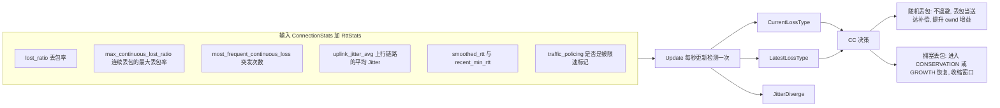
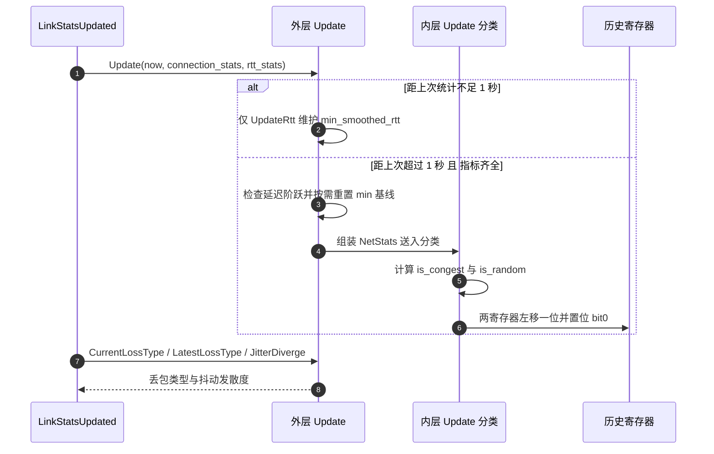
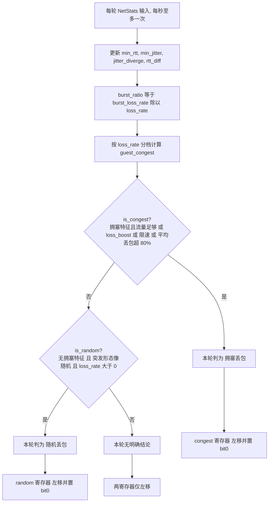
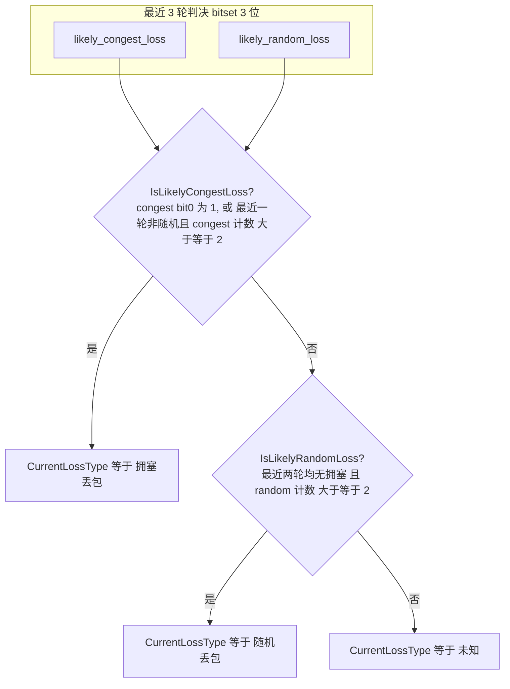

# 丢包类型检测算法

> 本文介绍丢包类型检测算法模块的功能与算法逻辑：如何用「Jitter + 排队延迟 + 突发形态 + 丢包率」多路信号，把丢包区分为**拥塞丢包（congestion loss）与随机丢包（random loss）**，并把结论反馈给拥塞控制算法，以保住决策是否需要降速。

---

## 为什么要区分丢包类型

对拥塞控制来说，丢包有两种截然不同的成因：

- **拥塞丢包**：瓶颈链路缓冲区被灌满、溢出丢包。它是真实拥塞的信号，**必须退避**（收缩窗口、进入 recovery），否则会加剧拥塞。
- **随机丢包**：无线误码、链路层偶发丢包，与拥塞无关。此时**不该退避**，退避就白白损失吞吐，在弱网/无线场景尤其重要。

如果把随机丢包误判为拥塞 → 无谓降速、吞吐塌陷；如果把拥塞丢包误判为随机 → 继续猛发、拥塞雪崩。所以这是一个**高价值、需精细调参的启发式判别**。

判别结果`loss_type` 直接改变 CC 的行为：


| loss_type         | CC 的反应                                                 |
| ----------------- | ------------------------------------------------------ |
| `kRandomLoss`     | 把丢的包当作已送达补偿进带宽估计、跳过恢复状态机、将 `PROBE_BW` 下 `cwnd_gain` 翻倍 |
| `kCongestionLoss` | 正常走 `CONSERVATION → GROWTH` 恢复、收缩恢复窗口                  |
| `kUnknown`        | 保持默认行为                                                 |

---

## 数据流与消费端

算法模块被定时驱动（500ms），输入链路统计，输出丢包类型与抖动发散度：




`PacketLossType` 枚举：`kUnknown = 0`、`kCongestionLoss = 1`、`kRandomLoss = 2`。

---


## 整体架构：双层 Update + 双历史寄存器 + 投票

算法有三个关键设计：

1. **双层** `Update`：外层(上层定时触发 )做**节流与基线维护**，内层(内部出发点)做**单轮分类**。
2. **两个 3 bit 滑动历史寄存器**：`likely_congest_loss` 与 `likely_random_loss`（`std::bitset<3>`），各自记录最近 3 轮的判决。
3. **投票 + 迟滞**：最终对外结论不是看单轮，而是对最近 3 轮做**非对称投票**。



---


## 外层 Update：节流与基线维护

外层`Update`负责让分类**每秒至多跑一次**(定时器控制)，并维护两条关键基线：

- **触发门槛**：`jitter_avg` 平均 jitter、`lost_ratio` 丢包率、`max_continuous_lost_ratio` 连续的最大丢包率，即 `max burst lost ratio` 都就绪，**且**距上次分类 **超过 1 秒**。否则只用当前 `smoothed_rtt` 维护 `min_smoothed_rtt`。
- `min_smoothed_rtt`：观测到的最小平滑 RTT，作为**传播时延基线**；`rtt_diff = smooth_rtt - min_smoothed_rtt` 即排队延迟。
- `min_jitter_` **/** `jitter_diverge_`：最小抖动基线与「当前抖动相对基线的发散量」`jitter_diverge_ = average_jitter - min_jitter_`。
- **延迟阶跃时重置基线**：当 `recent_min_rtt > min_smoothed_rtt + 80ms` 且 RTT 已稳定 ≥2s，或稳定 >8s 时，判定路径传播时延发生了真实阶跃 → `ResetMinJitter` 并把 `min_smoothed_rtt` 重置到当前值。避免基线长期停留在旧水平、导致 `rtt_diff` / `jitter_diverge` 永久偏大而误判。
- **RTT 稳定性跟踪**：`mean_deviation <= max(5ms, smoothed_rtt × 4%)` 视为稳定，记录稳定起始时间 `rtt_var_stable_start_time`；一旦不稳定即清零。它是上面「延迟阶跃重置」的前置门控。

---


## 内层 Update：单轮分类逻辑

内层 `Update(NetStats)` 是算法核心，围绕几个派生信号做判断：


| 信号                     | 含义                                                  | 指向                    |
| ---------------------- | --------------------------------------------------- | --------------------- |
| `rtt_diff`             | `smooth_rtt - min_smoothed_rtt`，排队延迟               | 大 → 拥塞                |
| `jitter_diverge`       | 抖动相对基线的发散量                                         | 大 → 拥塞                |
| `burst_ratio`          | `burst_loss_rate / loss_rate`，丢包中连续突发丢包率的占比        | 大 → 拥塞（队列溢出成片丢）       |
| `most_often_burst_cnt` | 最频繁的连续丢包段长度/次数                                      | 小且突发集中 → 拥塞；多而分散 → 随机 |
| `congest_condition`    | 流量足够大才判：`(≥200kbps 且 ≥30 包)` 或 `(≥100kbps 且 ≥60 包)` | 样本不足不下拥塞结论            |
| `loss_boost`           | 丢包率突增：`> prev + 0.6` 且 `> avg + 0.5`                | 陡增 → 拥塞               |
| `avg_loss_rate`        | 非对称 EWMA（涨得快、跌得慢）                                 | 长期极高 → 判拥塞            |


### 拥塞判定

先按丢包率分档算 `guest_congest`（"看起来像拥塞吗"），核心思路：**拥塞必须同时具备"延迟/抖动升高"与"突发成片丢包"两类特征**，且丢包率越高要求的突发证据越强：


| 丢包率区间         | `guest_congest` 判据（简化）                                                           |
| ------------- | -------------------------------------------------------------------------------- |
| `(0.05, 0.1)` | `burst_cnt ≤ 2` 且 `burst_ratio > 0.25` 且 `jitter_diverge > 20` 且 `rtt_diff > 20` |
| `[0.1, 0.65)` | 延迟抖动升高 且 `burst_cnt ≤ 3` 且突发占比达标；或 `burst_ratio > 0.75` 且 `loss ≥ 0.2`       |
| `[0.7, 1]`    | 延迟抖动升高 且突发占比更高门槛；或 `burst_ratio > 0.8` 且 `burst_cnt ≤ 3`                     |


最终：

```
is_congest = (guest_congest 且 congest_condition)
             或 loss_boost
             或 is_traffic_policing
             或 avg_loss_rate >= max_random_loss_rate(默认 0.8)
```

即：**拥塞特征成立且流量足够**，或**丢包陡增**，或**检测到限速**，或**长期平均丢包率高到不可能全是随机**（≥80%，可配置）。

### 随机判定

初始条件很直接：`jitter_diverge ≤ 50` 且 `rtt_diff ≤ 50` —— **丢包发生时延迟和抖动都没涨**，就像随机误码。此外还有一组基于突发形态的补充规则：**突发段很多（**`burst_cnt ≥ 7/10/12`**）但突发占比低（**`burst_ratio` **小）且抖动发散受限** → 说明丢包零散、互相独立，是随机特征；其中数条还叠加了历史随机判决（`likely_random_loss`）做迟滞。

最后一道闸：

```
is_random = is_random 且 (非 is_congest) 且 loss_rate > 0
```

**拥塞优先**：一旦判为拥塞，随机判定立即作废；无丢包则不判随机。

### 单轮流程图



---

## 投票：从 3 轮历史到最终结论

每轮把两个寄存器左移一位、按本轮结果置 `bit0`，于是它们始终保存**最近 3 轮**的判决。对外结论对二者做**非对称投票**：



判定函数的**非对称设计**是整套算法的核心：

- **拥塞容易确认**：`IsLikelyCongestLoss` 只要**最近一轮**判了拥塞（`bit0`）即成立，或 3 轮里 ≥2 轮拥塞且最近一轮非随机。因为漏判拥塞的代价（雪崩）远大于误判。
- **随机需要干净证据**：`IsLikelyRandomLoss` 要求**最近两轮都没有拥塞**且 3 轮里 ≥2 轮随机。因为误判随机会导致过量发送。
- `LatestLossType` 更保守：只有「窗口投票」与「最新一轮」都指向随机（`IsLikelyRandomLoss` 且 `IsLatestStatLikelyRandom`）才返回随机，否则一律当拥塞 —— 用于对时效更敏感的场景。

一句话概括判决哲学：**拥塞是"安全默认"，好进难出；随机是"高门槛特权"，需持续且干净的证据才认定。**

---


## 关键参数


| 参数            | 值                                       | 作用           |
| ------------- | --------------------------------------- | ------------ |
| 分类节流周期        | `1s`                                    | 每秒至多分类一次     |
| 延迟阶跃阈值        | `recent_min_rtt > min_rtt + 80ms`       | 触发基线重置       |
| RTT 稳定判据      | `mean_deviation ≤ max(5ms, srtt × 4%)`  | 基线重置的前置门控    |
| 稳定时长门控        | `≥2s`（配阶跃）或 `>8s`（单独）                   | 触发基线重置       |
| 随机初判阈值        | `jitter_diverge ≤ 50` 且 `rtt_diff ≤ 50` | 无延迟抖动升高即像随机  |
| 拥塞流量门槛        | `≥200kbps & ≥30 包` 或 `≥100kbps & ≥60 包` | 样本充分才判拥塞     |
| 丢包陡增          | `> prev + 0.6` 且 `> avg + 0.5`          | 直接判拥塞        |
| 最大随机丢包率       | `0.8`（可配 `SetMaxRandomLossRate`）        | 平均丢包超此值直接判拥塞 |
| 历史窗口          | 3 轮（`bitset<3>`）                        | 投票窗口         |
| avg_loss EWMA | 涨 `5/8·old+3/8·new`，跌 `7/8·old+1/8·new` | 对丢包上升更敏感     |


---


## 总结

`丢包网络类型算法` 是一个典型的**多信号 + 迟滞投票**判别器：

- **多信号交叉**：用「排队延迟 `rtt_diff` + 抖动发散 `jitter_diverge` + 突发占比 `burst_ratio` + 突发次数」共同刻画拥塞的"延迟升高且成片丢包"特征，用「延迟抖动不升 + 丢包零散」刻画随机特征；
- **基线自适应**：维护 min RTT / min jitter 基线，并在真实延迟阶跃时重置，避免基线漂移导致长期误判；
- **非对称迟滞投票**：3 轮历史寄存器 + "拥塞好进难出、随机高门槛"的判定，兼顾灵敏与稳健；
- **闭环价值**：结论直接决定 CC 对丢包"退不退避"，使 CC 在无线/弱网下既能抗随机丢包、又不放任真实拥塞的关键判别模块。

