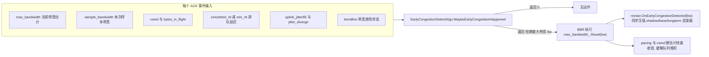
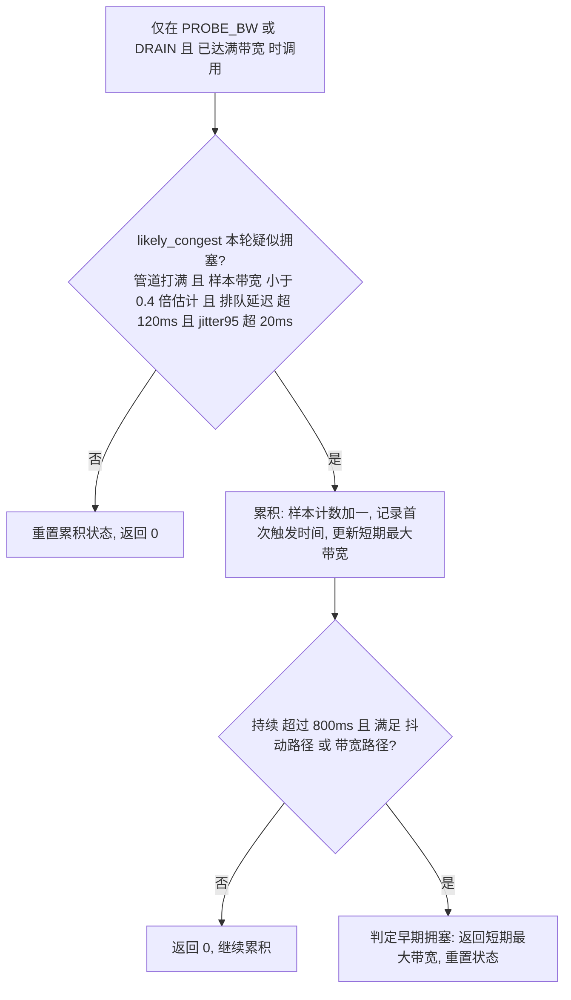
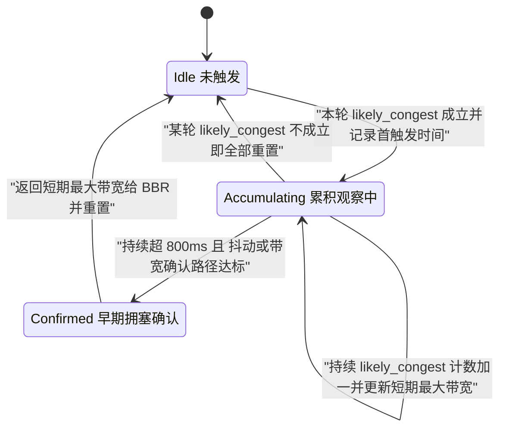

# 预拥塞检测算法

> 预拥塞检测算法的实现原理：实现如何在 BBR 稳定发送阶段，用「管道打满 + 带宽骤降 + 排队延迟升高 + 抖动升高」的组合信号快速识别早期拥塞，并跳过 BBR 缓慢的带宽滤波器，把带宽估计一步压到近期真实水平，从源头遏制排队延迟膨胀，降低网络拥塞的影响时长。

---

## 为什么需要**预拥塞检测**

BBR 用一个 **windowed-max 滤波器** `max_bandwidth` 记录最近若干轮的最大带宽样本作为带宽估计。这个设计对带宽**上升**很灵敏，但对带宽**下降**却很迟钝：

- 一旦链路可用带宽突然下降（竞争流涌入、无线链路恶化、路由切换到窄链路），BBR 仍会沿用滤波窗口里那个**过时的高带宽估计**继续发送；
- 结果是发送速率持续高于链路容量 → 数据堆进瓶颈缓冲区 → 排队延迟飙升（bufferbloat）；
- 要等旧的高带宽样本**滑出滤波窗口**，估计才会自然降下来，这个过程可能长达数个 RTT；而 `PROBE_RTT` 又要 10 秒才来一次，太慢。

预拥塞检测算法 `EarlyCongestionDetectAlgo` 就是为这个短板设计的**急刹车**：在带宽本应稳定的 `PROBE_BW` / `DRAIN` 阶段，实时监控 **链路管道已满却发不快、延迟和抖动却在涨** 这组矛盾信号，一旦持续成立，就判定**早期拥塞已经发生**，把 `max_bandwidth` 直接 Reset 到**近期真实观测到的短期最大带宽**，让 pacing 与 cwnd 快速收敛。

> 它和 `检测延迟突变算法` 是一对互补的"补丁"：后者修的是 `min_rtt`（链路延迟突变），前者修的是 `max_bandwidth`（带宽骤降）—— 都是在补 BBR**对下降反应慢**的天然缺陷。

---

## 数据流与消费端

检测器在 BBR 每个 ACK 事件中被调用，且**仅在 `mode_ == PROBE_BW 或 DRAIN` 且 `is_at_full_bandwidth` 时**才触发：

消费逻辑：返回非零 `bw` 时，BBR 把 windowed-max 滤波器**直接 Reset 到该值**（绕过慢速滑出），并把带宽修正器内部的三个影子滤波器一并压下去，避免它们把估计又顶回高位。

>为什么只在 `PROBE_BW` / `DRAIN` 且满带宽阶段生效？因为 `STARTUP` 阶段带宽本就在探测爬升、管道打满和延迟上升都是正常现象；只有在带宽理应稳定的阶段，"管道满 + 带宽降 + 延迟涨"同时出现才真正指向拥塞。

---

## 判定逻辑：两层门槛 + 时间持续

算法分两层：先判断**本轮是否疑似拥塞**（`likely_congest`），再对疑似状态做**状态累积确认**（持续 800ms + 二次论证）。

### 第一层：`likely_congest`（本轮疑似拥塞）

需**同时**满足如下四个条件，记 `remain = cwnd - bytes_in_flight`（剩余可发空间）：

| 条件 | 判据 | 直觉含义 |
| --- | --- | --- |
| **管道打满** | `remain ≤ 2×MSS 且 remain < cwnd×0.2`，或 `remain < bytes_acked 且 remain < cwnd×0.25` | inflight 几乎占满 cwnd，发送受 **cwnd 限制**而非应用限制 —— 想发但发不出去 |
| **带宽骤降** | `sample_bandwidth < max_bandwidth × 0.4` | 实测样本带宽跌到估计值的 40% 以下 |
| **排队延迟升高** | `smoothed_rtt - min_rtt > 120ms` | 明显 bufferbloat |
| **抖动佐证** | `uplink_jitter95 > 20ms` | 链路争用/受限的抖动特征 |

这四条构成一个**逻辑闭环**：管道明明打满了（说明有足够数据要发），实测带宽却只有估计的四成，同时延迟和抖动都在涨 —— 这只能解释为"链路容量已经下降、估计值虚高、数据在排队"。

**任一条件不满足** → 立即重置累积状态（首触发时间、样本计数、短期最大带宽全部清零），返回 0。这保证只有**持续**的疑似拥塞才会被累积。

### 第二层：累积确认

每轮 `likely_congest` 成立时：

- `likely_congest_sample_count++`（样本计数）；
- 首次成立时记录 `likely_congest_happened_time`；
- 用 `max_bandwidth_short_term` 跟踪疑似窗口内观测到的**最大样本带宽** —— 这就是将来要 Reset 到的目标值。

确认需**持续超过 800ms**，且满足以下**任一**二次证据路径：

| 确认路径 | 判据 | 说明 |
| --- | --- | --- |
| **抖动路径** | `sample_cnt > 20` 且（无 stats 或 `uplink_jitter_diverge > 100`） | 抖动相对基线发散严重（`jitter_diverge` 来自丢包类型判别模块） |
| **带宽路径** | `sample_cnt > 10` 且（无 stats 或 trendline 估计 == `kBwCongestion`） | Trendline 延迟梯度估计器独立判定为拥塞 |

确认后返回 `max_bandwidth_short_term` 并重置全部状态。

---

## 累积状态机

用「首触发时间戳 + 样本计数」把瞬时信号沉淀为持续判定：

设计算法：

- **单帧不算数**：任何一层不满足都会清零，杜绝瞬时毛刺误触发；
- **时间 + 计数双重持续性**：既要 800ms 时长，又要足够样本数（抖动路径 >20、带宽路径 >10），避免低采样率下误判；
- **两条独立确认路径**：抖动发散与 Trendline 拥塞判定互为补充，任一成立即可，提升召回；
- **Reset 到"短期最大"而非"瞬时最低"**：不把估计砸到疑似窗口内的最低样本（过度反应会导致带宽利用率骤降），而是取该窗口内的**最大样本**，做到"快速但不过激"地收敛。

---

## 关键参数一览

| 参数 | 值 | 作用 |
| --- | --- | --- |
| 生效阶段 | `PROBE_BW` / `DRAIN` 且 `is_at_full_bandwidth_` | 只在带宽应稳定时检测 |
| 管道打满阈值 1 | `remain ≤ 2×MSS` 且 `< 0.2×cwnd` | 剩余空间极小 |
| 管道打满阈值 2 | `remain < bytes_acked` 且 `< 0.25×cwnd` | 剩余不足一次 ACK |
| 带宽骤降阈值 | `sample_bandwidth < 0.4 × max_bandwidth` | 实测带宽腰斩到四成以下 |
| 排队延迟阈值 | `smoothed_rtt - min_rtt > 120ms` | bufferbloat 门槛 |
| 抖动初判阈值 | `uplink_jitter95 > 20ms` | 第一层抖动佐证 |
| 持续时长阈值 | `800ms` | 确认所需最短持续 |
| 抖动路径 | `sample_cnt > 20` 且 `jitter_diverge > 100` | 二次确认路径之一 |
| 带宽路径 | `sample_cnt > 10` 且 trendline == `kBwCongestion` | 二次确认路径之一 |

---

## 小结

`EarlyCongestionDetectAlgo` 是一个精巧的**带宽估计旁路急刹车**：

- **补 BBR 短板**：针对 windowed-max 带宽滤波器"对下降反应慢"的天然缺陷，提供一条快速下修通道，避免链路降容后长时间过量发送、堆积队列；
- **组合信号闭环**：以"管道满却发不快 + 带宽骤降 + 延迟升高 + 抖动升高"的矛盾组合精准刻画早期拥塞，逻辑自洽、误报率低；
- **两层门槛 + 双确认路径**：单帧判疑似、800ms 累积确认、抖动/Trendline 双路二次证据，兼顾灵敏与稳健；
- **温和收敛**：Reset 到短期最大带宽而非瞬时最低，快速缓解队列的同时避免带宽利用率过度塌陷。

